# Ultima IV tile reference

_Generated by `./run tiles` — do not edit by hand._  Names live in `ultima4/tiles.py` (`TILE_NAMES`). To rename a tile, use the **rename-tile** skill, e.g. `/rename-tile 0x4A -> stone_altar` (it updates the source, cascades animation-frame names, regenerates this file, and runs the tests).

All 256 tiles from `SHAPES.EGA`, laid out as a grid so you can see them together (the hex id is each tile's `(row,col)` — row = high nibble, col = low nibble). Cells marked **?** still need a name.

| _ | +0 | +1 | +2 | +3 | +4 | +5 | +6 | +7 | +8 | +9 | +A | +B | +C | +D | +E | +F |
|---|---|---|---|---|---|---|---|---|---|---|---|---|---|---|---|---|
| **00** | 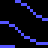 `00` deep_water | 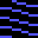 `01` medium_water | 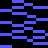 `02` shallow_water | 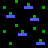 `03` swamp | 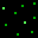 `04` grass | 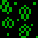 `05` scrub |  `06` forest | 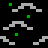 `07` hills |  `08` mountains | 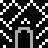 `09` dungeon_entrance | 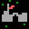 `0A` town |  `0B` castle | 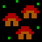 `0C` village | 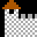 `0D` lb_castle_left_wing | 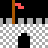 `0E` lb_castle_entrance | 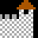 `0F` lb_castle_right_wing |
| **10** |  `10` ship_w |  `11` ship_n |  `12` ship_e |  `13` ship_s | 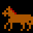 `14` horse_w | 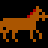 `15` horse_e |  `16` tiled_floor |  `17` bridge |  `18` balloon |  `19` bridge_top | 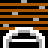 `1A` bridge_bottom |  `1B` ladder_up |  `1C` ladder_down | 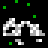 `1D` ruins |  `1E` shrine | 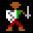 `1F` avatar_on_foot |
| **20** | 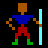 `20` mage | 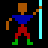 `21` mage2 | 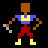 `22` bard | 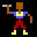 `23` bard2 | 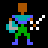 `24` fighter | 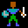 `25` fighter2 | 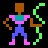 `26` druid | 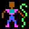 `27` druid2 | 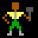 `28` tinker | 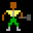 `29` tinker2 | 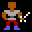 `2A` paladin | 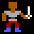 `2B` paladin2 | 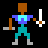 `2C` ranger | 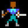 `2D` ranger2 | 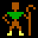 `2E` shepherd | 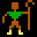 `2F` shepherd2 |
| **30** |  `30` force_field |  `31` force_field_1 | 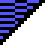 `32` force_field_2 | 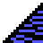 `33` force_field_3 | 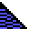 `34` force_field_4 | 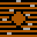 `35` ship_rail | 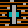 `36` ship_mast | 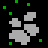 `37` rocks | 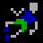 `38` body | 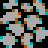 `39` cobblestones | 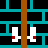 `3A` locked_door | 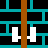 `3B` door |  `3C` chest |  `3D` ankh |  `3E` brick_floor | 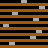 `3F` wood_floor |
| **40** | 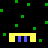 `40` moongate_phase_0 | 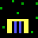 `41` moongate_phase_1 | 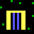 `42` moongate_phase_2 | 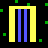 `43` moongate_phase_3 | 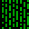 `44` poison_field |  `45` energy_field |  `46` fire_field |  `47` sleep_field |  `48` white |  `49` secret_door_brick |  `4A` altar |  `4B` spit_roast |  `4C` lava |  `4D` missile |  `4E` magic_burst |  `4F` magic_burst2 |
| **50** |  `50` guard |  `51` guard2 |  `52` merchant |  `53` merchant2 |  `54` bard_npc |  `55` bard_npc_2 |  `56` jester |  `57` jester2 |  `58` beggar |  `59` beggar2 |  `5A` child |  `5B` child2 |  `5C` bull |  `5D` bull2 |  `5E` lord_british |  `5F` lord_british2 |
| **60** |  `60` letter_a |  `61` letter_b |  `62` letter_c |  `63` letter_d |  `64` letter_e |  `65` letter_f |  `66` letter_g |  `67` letter_h |  `68` letter_i |  `69` letter_j |  `6A` letter_k |  `6B` letter_l |  `6C` letter_m |  `6D` letter_n |  `6E` letter_o |  `6F` letter_p |
| **70** |  `70` letter_q |  `71` letter_r |  `72` letter_s |  `73` letter_t |  `74` letter_u |  `75` letter_v |  `76` letter_w |  `77` letter_x |  `78` letter_y |  `79` letter_z |  `7A` sign_blank |  `7B` sign_border_right |  `7C` sign_border_left |  `7D` sign_border_bottom |  `7E` sign_border_top |  `7F` brick |
| **80** |  `80` pirate_ship_w |  `81` pirate_ship_n |  `82` pirate_ship_e |  `83` pirate_ship_s |  `84` nixie |  `85` nixie2 |  `86` squid |  `87` squid2 |  `88` sea_serpent |  `89` sea_serpent2 |  `8A` seahorse |  `8B` seahorse2 |  `8C` whirlpool |  `8D` whirlpool2 |  `8E` twister |  `8F` twister2 |
| **90** |  `90` rat |  `91` rat2 |  `92` rat3 |  `93` rat4 |  `94` bat |  `95` bat2 |  `96` bat3 |  `97` bat4 |  `98` spider |  `99` spider2 |  `9A` spider3 |  `9B` spider4 |  `9C` ghost |  `9D` ghost2 |  `9E` ghost3 |  `9F` ghost4 |
| **A0** |  `A0` slime |  `A1` slime2 |  `A2` slime3 |  `A3` slime4 |  `A4` troll |  `A5` troll2 |  `A6` troll3 |  `A7` troll4 |  `A8` gremlin |  `A9` gremlin2 |  `AA` gremlin3 |  `AB` gremlin4 |  `AC` mimic |  `AD` mimic2 |  `AE` mimic3 |  `AF` mimic4 |
| **B0** |  `B0` reaper |  `B1` reaper2 |  `B2` reaper3 |  `B3` reaper4 |  `B4` insects |  `B5` insects2 |  `B6` insects3 |  `B7` insects4 |  `B8` gazer |  `B9` gazer2 |  `BA` gazer3 |  `BB` gazer4 |  `BC` phantom |  `BD` phantom2 |  `BE` phantom3 |  `BF` phantom4 |
| **C0** |  `C0` orc |  `C1` orc2 |  `C2` orc3 |  `C3` orc4 |  `C4` skeleton |  `C5` skeleton2 |  `C6` skeleton3 |  `C7` skeleton4 |  `C8` rogue |  `C9` rogue2 |  `CA` rogue3 |  `CB` rogue4 |  `CC` python |  `CD` python2 |  `CE` python3 |  `CF` python4 |
| **D0** |  `D0` ettin |  `D1` ettin2 |  `D2` ettin3 |  `D3` ettin4 |  `D4` headless |  `D5` headless2 |  `D6` headless3 |  `D7` headless4 |  `D8` cyclops |  `D9` cyclops2 |  `DA` cyclops3 |  `DB` cyclops4 |  `DC` wisp |  `DD` wisp2 |  `DE` wisp3 |  `DF` wisp4 |
| **E0** |  `E0` mage_monster |  `E1` mage_monster_2 |  `E2` mage_monster_3 |  `E3` mage_monster_4 |  `E4` lich |  `E5` lich2 |  `E6` lich3 |  `E7` lich4 |  `E8` lava_lizard |  `E9` lava_lizard2 |  `EA` lava_lizard3 |  `EB` lava_lizard4 |  `EC` zorn |  `ED` zorn2 |  `EE` zorn3 |  `EF` zorn4 |
| **F0** |  `F0` daemon |  `F1` daemon2 |  `F2` daemon3 |  `F3` daemon4 |  `F4` hydra |  `F5` hydra2 |  `F6` hydra3 |  `F7` hydra4 |  `F8` dragon |  `F9` dragon2 |  `FA` dragon3 |  `FB` dragon4 |  `FC` balron |  `FD` balron2 |  `FE` balron3 |  `FF` balron4 |

**256/256 named, 0 still need names.** Walkable-on-foot tiles (for reference): `03`, `04`, `05`, `06`, `07`, `09`, `0A`, `0B`, `0C`, `10`, `11`, `12`, `13`, `14`, `15`, `16`, `17`, `18`, `19`, `1A`, `1B`, `1C`, `1D`, `1E`, `3C`, `3E`, `3F`, `43`, `44`, `46`, `47`, `49`, `4A`, `4C`, `8E`, `8F`.
